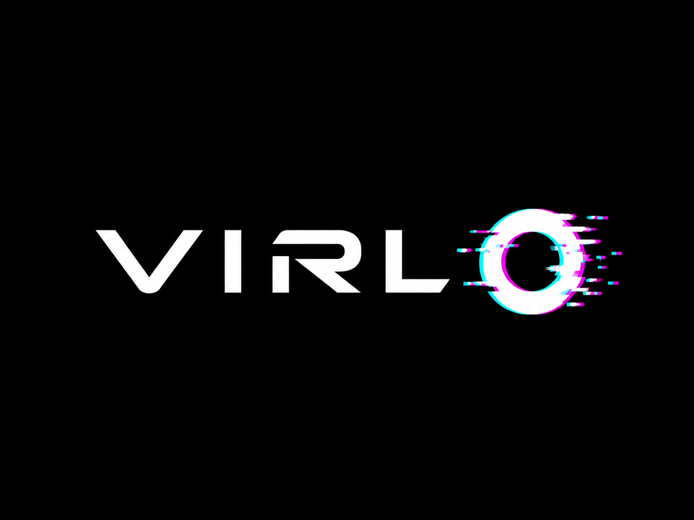

<div align="center">
  
  <h1>Virlo</h1>
  <p><strong>URL to viral UGC video in 60 seconds.</strong></p>
  <p>
    <a href="https://virlo.ai">Website</a> ·
    <a href="https://x.com/virlo_ai">Twitter</a> ·
    <a href="mailto:hello@virlo.ai">Contact</a>
  </p>
</div>

---

## What is Virlo?

Virlo is an AI-powered UGC video factory. Paste any product URL and Virlo's
Intelligence Engine writes a platform-optimized script, renders a hyper-realistic
avatar, generates cinematic B-roll, assembles the final video, and delivers
a publish-ready MP4 — all in under 60 seconds.

**No editing software. No UGC creator fees. No guesswork.**

---

## Core Features

| Feature | Description |
|---|---|
| **Trend-aware Scripts** | Real-time social data powers hooks that feel current, not generic |
| **Hyper-realistic Avatars** | 40+ ultra-realistic avatar styles across 175+ languages with auto lip-sync |
| **Native 4K B-Roll** | Scene-by-scene cinematic generation with zero quality degradation |
| **5-Variant A/B Testing** | Curiosity · Fear · Social Proof · Transformation · Controversy — in parallel |
| **Infinite-Length Video** | 30-second ads to 10-minute documentaries — same pipeline, no quality cap |
| **Brand Voice Memory** | Train on your past content. Every video sounds like you |
| **API Access** | Full programmatic control over the entire pipeline |

---

## Architecture

Virlo is a full-stack monorepo with two workspaces:

```
virlo/
├── frontend/          # Next.js 15 — App Router, React Server Components
│   ├── src/app/
│   │   ├── components/    # Navbar, Hero, FeaturesGrid, PipelineVisual…
│   │   ├── api-docs/      # API reference page
│   │   ├── long-form/     # Long-form video engine page
│   │   ├── ab-test/       # A/B hook testing page
│   │   └── architecture/  # Platform architecture page
│   └── public/
│       ├── logo.png
│       └── favicon.png
│
├── backend/           # Node.js + Express — AI pipeline orchestration
│   └── src/
│       ├── api/           # REST endpoints
│       ├── services/      # Intelligence Core, Avatar Engine, Video Engine
│       ├── middleware/     # Job queue, auth, rate limiting
│       └── server.js
│
├── .env               # Root environment (shared secrets)
└── package.json       # Monorepo workspaces
```

### Service Layer Stack

```
API Gateway      →  Rate Limiting · Auth · Secure Endpoints
Orchestration    →  Pipeline Manager · Async Job Queue · Workers
Intelligence Core →  Script Engine · Storyboard · Brand Voice
Video Engines    →  Native 4K Generation · Avatar Engine · Cinematic B-Roll
Post-processing  →  Seamless Concat · Global Captions · Audio Ducking · Final Export
```

---

## Getting Started (Internal Dev)

### Prerequisites
- Node.js 20+
- npm 10+
- Access to authorized environment credentials

### 1. Clone and install

```bash
git clone https://github.com/virlo-ai/virlo.git
cd virlo
npm install
cd backend && npm install
cd ../frontend && npm install
```

### 2. Configure environment variables

Copy `.env.example` to `.env` in both root and `backend/`:

```bash
cp .env.example .env
cp backend/.env.example backend/.env
```

Required backend variables:

```env
REDIS_HOST=
REDIS_PORT=
REDIS_USER=
REDIS_PASSWORD=
PORT=3001
```

Required frontend variables:

```env
NEXT_PUBLIC_API_URL=http://localhost:3001
```

### 3. Start development servers

**Backend:**
```bash
cd backend
npm run dev
# Runs on http://localhost:3001
```

**Frontend:**
```bash
cd frontend
npm run dev
# Runs on http://localhost:3000
```

---

## API Reference

### Generate a short-form video
```http
POST /api/video/generate
Content-Type: application/json

{
  "productUrl": "https://yourproduct.com/item",
  "platform": "tiktok",
  "duration": 30,
  "tone": "casual"
}
```
Returns a `jobId` immediately. Poll `/api/video/job/:jobId` for status.

### Generate a long-form video
```http
POST /api/video/long-form
Content-Type: application/json

{
  "topic": "How our product transforms dry skin in 7 days",
  "durationMins": 3,
  "style": "documentary"
}
```

### Generate 5 A/B hook variants
```http
POST /api/video/ab-test
Content-Type: application/json

{
  "productUrl": "https://yourproduct.com/item",
  "avatarId": "avatar_001",
  "voiceId": "voice_en_001"
}
```

### Localize video to multiple languages
```http
POST /api/video/localize
Content-Type: application/json

{
  "videoId": "vid_xxx",
  "languages": [
    { "code": "es", "market": "Mexico" },
    { "code": "pt", "market": "Brazil" }
  ]
}
```

---

## Async Job Polling

All video generation endpoints are non-blocking. They return a `jobId` instantly.
Poll the job status endpoint every 5 seconds:

```http
GET /api/video/job/:jobId
```

Response:
```json
{
  "data": {
    "status": "completed",
    "result": {
      "videoId": "vid_xxx",
      "downloadUrl": "https://...",
      "scriptData": { "hook": "...", "cta": "..." }
    }
  }
}
```

Possible statuses: `queued` · `processing` · `completed` · `failed`

---

## Pricing

| Plan | Price | Videos | Key Features |
|---|---|---|---|
| **Starter** | $49/mo | 30/mo | TikTok + Reels + Shorts, 5 avatars, A/B testing |
| **Scale** | $149/mo | Unlimited | 40+ avatars, long-form, brand voice, 5 languages |
| **Enterprise** | Custom | Unlimited | API access, custom avatar cloning, 175+ languages, SLA |

---

## Deployment

| Service | Platform |
|---|---|
| Frontend | Vercel (auto-deploy from `main`) |
| Backend | Render / Railway |
| Job Queue | Redis Cloud |

---

## Contributing

This is a **private, proprietary repository**. Contributions are restricted to
authorized team members only. All contributors must sign the Virlo Contributor
Agreement before submitting any code.

---

## License

Copyright © 2025 Virlo. All Rights Reserved.  
See [LICENSE](./LICENSE) for full terms.

---

<div align="center">
  <sub>Built with precision. Powered by the best AI infrastructure on the planet.</sub>
</div>
